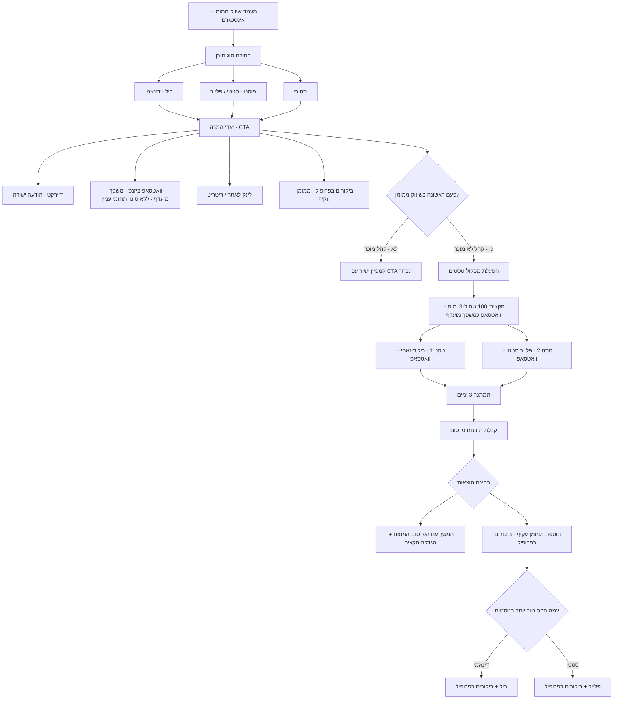

# אסטרטגיית שיווק ממומן - אינסטגרם: תרשים זרימה ומפת חשיבה

---

## חלק 1: מפת חשיבה טקסטואלית מובנית

### נקודת מוצא: מעמד שיווק ממומן - אינסטגרם

---

#### 1. סוגי תוכן (Content Types)

- **ריל (Reel)** - תוכן דינאמי (וידאו קצר)
- **פוסט** - תוכן סטטי (פלייר / תמונה)
- **סטורי** - תוכן קצר-טווח

---

#### 2. יעדי המרה (CTAs) - זמין לכל סוג תוכן

- **דיירקט** - הודעה ישירה באינסטגרם
- **וואטסאפ ביזנס** - *משפך מועדף* (הפניות איכותיות ורציניות)
  - *מגבלה חשובה:* בבחירת CTA זה - **אין אפשרות לסנן תחומי עניין** בבחירת קהל היעד
- **לינק לאתר / ריטריט** - מעבר ישיר לדף נחיתה / דף מוצר
- **ביקורים בפרופיל** - ממומן עקיף

---

#### 3. צומת ההחלטה: האם זו פעם ראשונה בשיווק ממומן?

##### מסלול א' - קהל מוכר (לא פעם ראשונה)
- המשך קמפיין ישיר עם שילוב סוג תוכן + CTA נבחר

---

##### מסלול ב' - קהל לא מוכר (פעם ראשונה) -> הפעלת מסלול טסטים

**שלב 1: הגדרת הטסטים**
- תקציב: 100 ש"ח ל-3 ימים
- משפך יעד: וואטסאפ ביזנס (מועדף)
- 2 טסטים במקביל:
  - **טסט 1:** ריל (דינאמי) -> הודעה לוואטסאפ
  - **טסט 2:** פלייר סטטי (כפוסט או כסטורי) -> הודעה לוואטסאפ

**שלב 2: המתנה - 3 ימים**

**שלב 3: קבלת תובנות פרסום (Insights) ובחינת תוצאות**

**שלב 4: אופטימיזציה - שתי פעולות מקבילות:**

- **פעולה א' - המשך עם המנצח:**
  - זיהוי הפרסום בעל התוצאות הטובות יותר
  - הגדלת תקציב לאותו פרסום

- **פעולה ב' - שילוב ממומן עקיף:**
  - הוספת קמפיין ביקורים בפרופיל
  - בחירת סוג התוכן לפי מה שתפס טוב יותר בטסטים:
    - אם **דינאמי** תפס יותר -> ריל + ביקורים בפרופיל
    - אם **סטטי** תפס יותר -> פלייר + ביקורים בפרופיל

---

## חלק 2: תרשים זרימה ויזואלי - Mermaid.js

